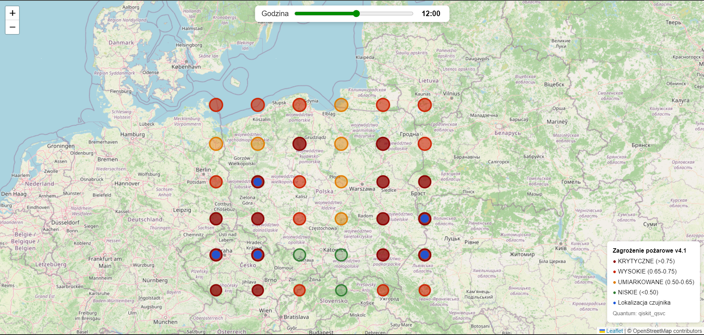

# 🔥 QHDALabs — Wildfire Risk PL

> A hybrid wildfire risk prediction system for Poland combining classical machine learning (Random Forest), quantum computing (Qiskit QSVC + SamplingVQE), model explainability (SHAP), and always-on quantum scoring in v4.

[](LICENSE)
[](https://python.org)
[](https://qiskit.org)

---

## 🗂️ Versions

| Version | File | Description |
|---------|------|-------------|
| **v1** | `qhdalabs-wildfire_risk_v1.py` | MVP — weather + RF + QSVC, Leaflet map |
| **v2** | `qhdalabs-wildfire_risk_v2.py` | EFFIS labels, NDVI, terrain, SHAP, QAOA (requires ~1 TB RAM on full grid — kept for reference) |
| **v3** | `qhdalabs-wildfire_risk_v3.py` | SamplingVQE with candidate pre-filtering (8 qubits → runs on any laptop) |
| **v4** | `v4/qhdalabs-wildfire_risk_v4.py` | Always-on quantum scoring: Qiskit QSVC + NumPy quantum-kernel fallback, improved cache/retry and safer one-class training  |
|**v4.2**| `v4_2/qhdalabs-wildfire_risk_v4_2.py` |v4.1 fixes (FWI, ndvi drought, calibration) retained. ✅ **recommended**|
---

## 📋 Overview

The system fetches real-time weather, vegetation stress, and terrain data for a configurable grid of points covering Poland, trains a hybrid classical/quantum classifier, and generates an interactive risk map with per-cell model explanations.

**Input data (v2+, per grid cell):**

| Source | Variables |
|--------|-----------|
| [Open-Meteo](https://open-meteo.com/) | temperature, humidity, wind, precipitation, VPD, soil moisture |
| [Open-Elevation](https://api.open-elevation.com/) | elevation (m), terrain slope (°) |
| NDVI proxy | vegetation stress index derived from VPD + soil + temperature |
| [EFFIS API](https://effis.jrc.ec.europa.eu/) | historical fire incidents (training labels) |

**Outputs:**

| File | Description |
|------|-------------|
| `map.html` | Interactive Leaflet map with hourly timeline slider |
| `fire.json` | Full results including SHAP drivers, hourly risk per cell, and v4 quantum status |
| `fire.csv` | Flat summary for dashboards or further analysis |
| `shap_report.html` | Explainability report: top-3 features driving risk per cell |

---

## 🗺️ Risk Map

Three risk tiers + hourly timeline slider (00:00–23:00) + QAOA/VQE sensor markers:

| Colour | Level | Threshold |
|--------|-------|-----------|
| 🔴 Red | **Alert** | > 0.70 |
| 🟠 Orange | Elevated | 0.40 – 0.70 |
| 🟢 Green | Low | < 0.40 |
| 🔵 Blue | Sensor (QAOA/VQE) | — |



---

## ⚙️ Installation

**Python 3.10+**

```bash
# Required
pip install numpy requests scikit-learn shap

# Quantum — QSVC classifier
pip install qiskit qiskit-machine-learning

# Quantum — SamplingVQE sensor placement (v3/v4)
pip install qiskit-algorithms qiskit-optimization
```

> In v1-v3, quantum modules are optional and the system can fall back to classical equivalents when Qiskit is unavailable or when training data contains only one class.

> In v4, quantum scoring is always attempted. If Qiskit QSVC cannot run, v4 uses a built-in NumPy statevector quantum-kernel fallback, so `quantum_risk` is still produced.

---

## 🚀 Usage

Recommended v4:

```bash
python v4/qhdalabs-wildfire_risk_v4.py
```

Windows:

```bash
py v4/qhdalabs-wildfire_risk_v4.py
```

Older v3:

```bash
python qhdalabs-wildfire_risk_v3.py
```

Example output (v4, outside fire season with EFFIS labels containing one class):

```text
12:16:48  INFO  Fetching 36 grid cells with 10 workers ...
12:17:15  INFO  Dataset ready: 36 cells (EFFIS labels: 36, heuristic: 0)
12:17:16  INFO  Classical model trained (CV skipped: not enough samples per class).
12:17:17  INFO  SHAP values computed.
12:17:17  WARNING  Quantum training data had one class (0). Added 4 conservative synthetic class-1 samples.
12:17:19  INFO  Training quantum model with Qiskit QSVC ...
12:17:27  INFO  Quantum model trained: qiskit_qsvc.
12:17:46  INFO  Alerts: 0 / 36 cells
12:17:47  INFO  SamplingVQE: optimizing sensor placement (8 candidates -> 5 sensors) ...
12:17:50  INFO  Quantum sensor placement complete.
12:17:50  INFO  Done -> map.html  fire.json  fire.csv  shap_report.html
```

---

## 🏗️ Architecture (v4)

```text
Open-Meteo + Open-Elevation + NDVI proxy
         │  (parallel fetch, TTL cache, retry on 429/5xx)
         ▼
┌──────────────────────────────┐
│    Feature Engineering       │  16 features:
│  weather + terrain + NDVI    │  VPD, slope, elevation,
└─────────────┬────────────────┘  wind_max, temp_mean, …
              │
     EFFIS API labels ──→ heuristic fallback
              │
         ┌────┴──────┐
         ▼           ▼
   ┌──────────┐  ┌──────────────────────────────┐
   │  Random  │  │  Qiskit QSVC                 │
   │  Forest  │  │  or NumPy quantum fallback   │
   │   70%    │  │     30%                      │
   └────┬─────┘  └──────┬───────────────────────┘
        └────────┬───────┘
                 ▼
           final score
            (0.0–1.0)
                 │
      ┌──────────┼──────────────┐
      ▼          ▼              ▼
   map.html   fire.json   shap_report.html
  (timeline)  (+ SHAP)    (+ quantum_status)
                 │
      SamplingVQE pre-filter
      top-8 cells → 5 sensors
      (fallback: diverse greedy)
                 ▼
          📡 sensor markers
```

---

## 🔧 Configuration

```python
GRID_SIZE            = 6       # grid resolution (6×6 = 36 cells)
ALERT_THRESHOLD      = 0.7     # alert threshold (0.0–1.0)
MAX_WORKERS          = 10      # parallel API threads
CACHE_TTL            = 3600    # cache TTL in seconds (1 hour)
EFFIS_LOOKBACK       = 365     # days of historical fire data from EFFIS
N_SENSORS            = 5       # number of sensors to place (VQE/QAOA)
QUANTUM_BLEND        = 0.30    # quantum model contribution to final risk score
```

Older v3 uses a smaller default worker count and a longer cache TTL:

```python
MAX_WORKERS          = 4
CACHE_TTL            = 21600
MAX_CANDIDATES       = 8       # pre-filter before quantum opt (2^8 = 256 states)
```

---

## 🧠 SHAP Explainability

Every grid cell in `fire.json` includes a `shap_drivers` field showing the top-3 features that drove its risk score:

```json
"shap_drivers": [
  { "feature": "vpd",         "shap":  0.142 },
  { "feature": "ndvi_stress", "shap":  0.098 },
  { "feature": "slope_deg",   "shap":  0.061 }
]
```

A full tabular report is saved to `shap_report.html`.

---

## ⚛️ Quantum Modules

### QSVC — Risk Classification

1. Dimensionality reduction to 4 features via PCA
2. Feature scaling to `[0, π]` (MinMaxScaler)
3. Quantum encoding via **ZZFeatureMap** / `zz_feature_map` (4 qubits, 2 reps)
4. Quantum kernel via **FidelityQuantumKernel**
5. Sigmoid calibration → score in [0, 1]
6. Blended output: **70% RF + 30% quantum**

### v4 — Always-On Quantum Scoring

v4 always attempts to train and use the quantum branch:

1. First it tries **Qiskit QSVC**.
2. If Qiskit is unavailable or fails, it uses a built-in **NumPy statevector quantum-kernel SVC**.
3. If training labels contain only one class, it adds conservative synthetic counterexamples so the quantum classifier can still train.

This makes `quantum_risk` available even outside fire season, when EFFIS may return only non-fire labels.

Example v4 metadata in `fire.json`:

```json
"quantum_status": {
  "backend": "qiskit_qsvc",
  "augmented": true,
  "train_size": 31,
  "original_classes": [0],
  "blend_weight": 0.3
}
```

### SamplingVQE — IoT Sensor Placement

1. Classical pre-selection of top-8 highest-risk cells
2. Problem formulated as QUBO (Quadratic Unconstrained Binary Optimization)
3. **SamplingVQE** with RealAmplitudes ansatz on statevector simulator
4. 8 qubits = 256 states = ~2 KB RAM, converges in seconds
5. Output: 5 optimal sensor locations shown on map

> **Why pre-filtering?** A statevector simulator requires 2^n states in memory. Without filtering: 36 variables = 2^36 = **1 TiB RAM** (v2 behaviour, kept for reference). With 8 candidates: 2^8 = **256 states**. Same quantum optimisation, laptop-friendly.

> **Why SamplingVQE over QAOA?** SamplingVQE with a RealAmplitudes ansatz converges significantly faster on a simulator than QAOA for this problem size, while producing equivalent quality solutions for weighted coverage optimisation.

---

## ⚠️ Training Labels

The system queries the **EFFIS API** for historical fire incidents within 50 km of each grid point (past 365 days). When the API is unreachable, it falls back to heuristic thresholds with a clear log warning:

```text
⚠ All labels are heuristic — EFFIS API may be unreachable.
  Model learns a rule, not real fire risk.
```

Real fire incident data sources:
- [EFFIS — European Forest Fire Information System](https://effis.jrc.ec.europa.eu/)
- [BDOT10k — Polish Topographic Object Database](https://www.geoportal.gov.pl/)

---

## 📄 Research & Verification

| Document | Description |
|----------|-------------|
| [`banasiewicz_rqm_scpf_verification_2026.pdf`](banasiewicz_rqm_scpf_verification_2026.pdf) | RQM/SCPF methodology verification (EN) |
| [`banasiewicz_rqm_scpf_verification_2026_PL.pdf`](banasiewicz_rqm_scpf_verification_2026_PL.pdf) | RQM/SCPF methodology verification (PL) |

---

## 📁 Repository Structure

```text
QHDALabs-wildfire-risk-pl/
├── qhdalabs-wildfire_risk_v1.py         # v1: MVP
├── qhdalabs-wildfire_risk_v2.py         # v2: full QAOA (1 TB RAM reference)
├── qhdalabs-wildfire_risk_v3.py         # v3: SamplingVQE
├── v4/
│   ├── qhdalabs-wildfire_risk_v4.py     # v4: always-on quantum ✅ recommended
│   └── README.md                        # v4-specific guide
├── map.html                             # generated risk map
├── fire.json                            # results + SHAP + hourly risk
├── fire.csv                             # flat summary
├── shap_report.html                     # SHAP explainability report
├── shap_report_v4.html                  # SHAP report v4 (experimental)
├── example_map.png                      # screenshot for README
├── banasiewicz_rqm_scpf_verification_2026.pdf
├── banasiewicz_rqm_scpf_verification_2026_PL.pdf
├── .github/FUNDING.yml                  # Patreon funding
├── .gitignore
├── LICENSE                              # MIT
└── README.md
```

---

## 📜 License

MIT — free to use, modify and distribute with attribution.

---

*QHDALabs — building the foundation for autonomous environmental protection infrastructure.*
